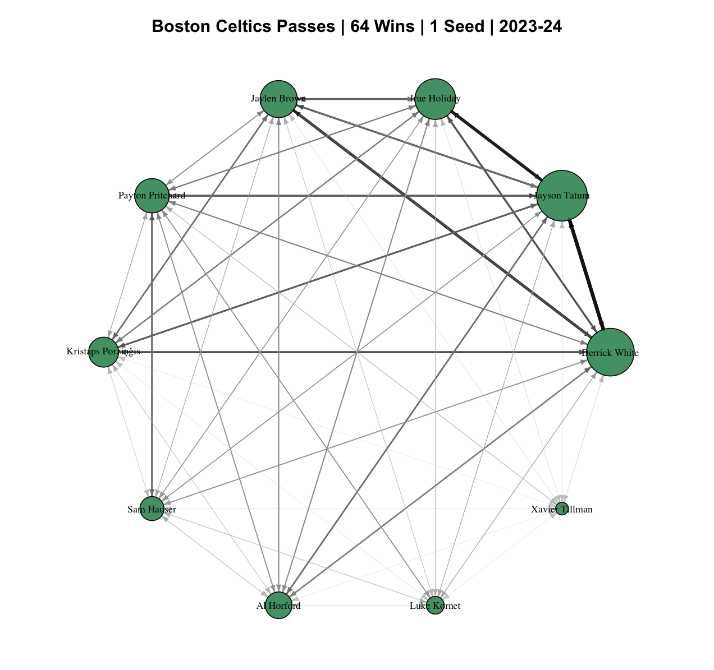
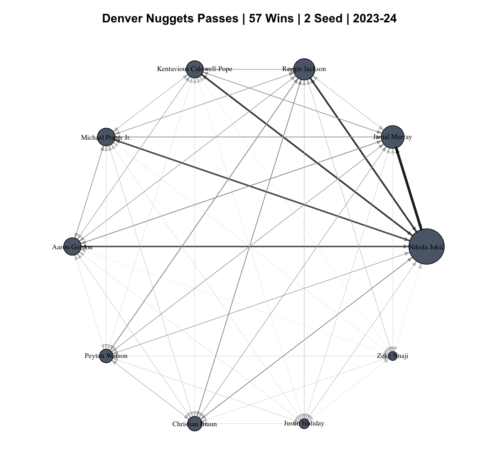
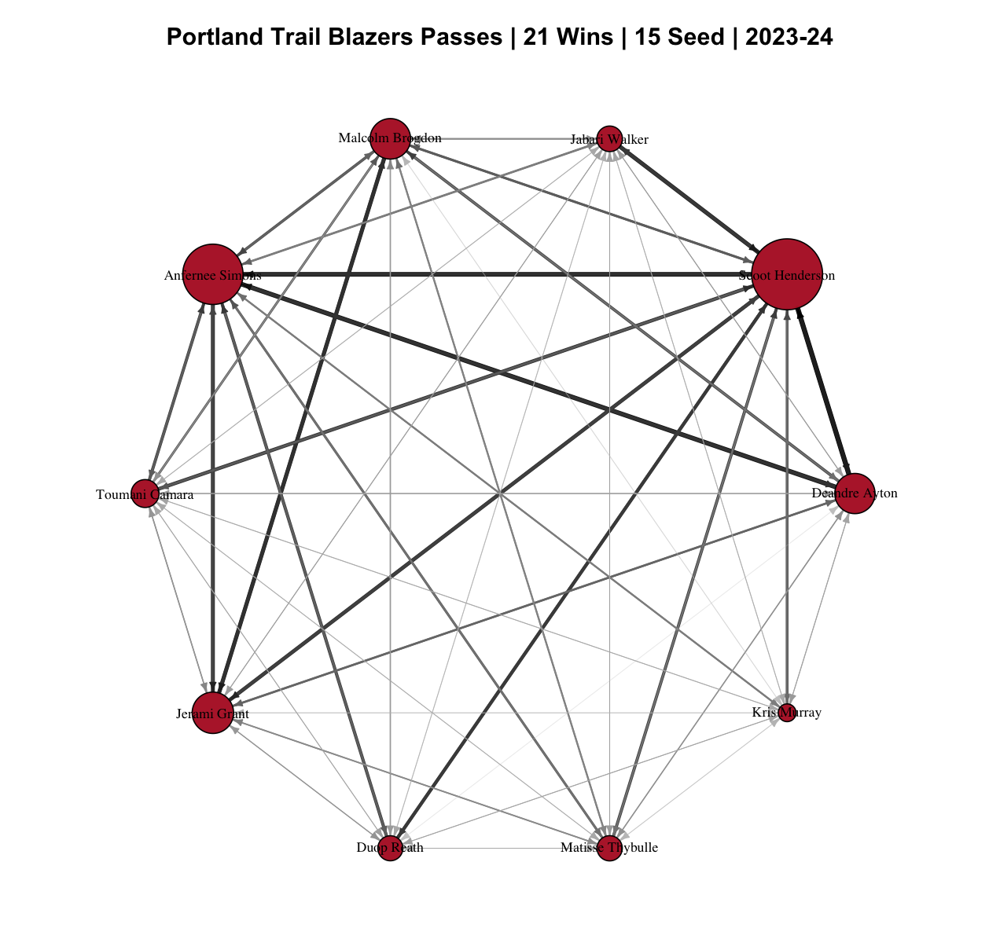

# NBA Passing Networks (SNAP Final Project)

This repository contains the code, data, and analysis for my Social Network Analysis Project (SNAP) on **NBA passing networks** from the 2023–24 and 2024–25 seasons.

Built NBA player passing networks in **Python** to map ball movement and team dynamics.  
Utilized **R** to analyze **global network properties** and model tie formation using **ALAAM** (Autologistic Actor Attribute Model) and **ERGMs** (Exponential Random Graph Models), evaluating how network position influences **team success** and **individual scoring performance**.

---

## 📂 Repository Structure

- **`analysis/`**  
  - `SNAP_Analysis.qmd` – Quarto document containing the full **R** analysis, including network construction, visualization, and statistical modeling.

- **`data/`**  
  - **`attributes23/`** – Player-level attributes for the 2023–24 season.  
  - **`teams23/`** – Passing event CSVs for all NBA teams in the 2023–24 season.  
  - **`teams24/`** – Passing event CSVs for all NBA teams in the 2024–25 season.

- **`docs/figures/`**  
  - Example network visualizations generated in the analysis.

- **`python/`**  
  - `ALAAM_attribute_player_data_scraper.py` – Gathers player attributes for ALAAM analysis.  
  - `nba_api.stats.py` – Retrieves raw stats data from the NBA API.  
  - `team_passes_scraper.py` – Scrapes passing event data for all teams.  
  - `requirements.txt` – Python dependencies.

- **`slides/`**  
  - [`SNAP_Final_Report.pdf`](slides/SNAP_Final_Report.pdf) – Detailed written report of the project.  
  - [`SNAP_Final_Presentation.pdf`](slides/SNAP_Final_Presentation.pdf) – Summary slides with key findings.

---

## 📊 Example Network Visualizations

Passing networks reveal team ball movement tendencies, highlighting hubs, peripheral players, and connectivity.

| 2023–24 Example | 2024–25 Example | Metric Visualization |
|-----------------|-----------------|----------------------|
|  |  |  |

---

## 📄 Learn More

- 📘 [Read the full report](slides/SNAP_Final_Report.pdf)  
- 🎯 [View the presentation slides](slides/SNAP_Final_Presentation.pdf)

---

## 🛠️ Tools & Languages

- **R** – Network analysis, visualization, global property computation, ALAAM & ERGM modeling  
- **Python** – Data scraping & preprocessing (NBA API, CSV generation)  
- **Makefile** – Workflow automation

---

